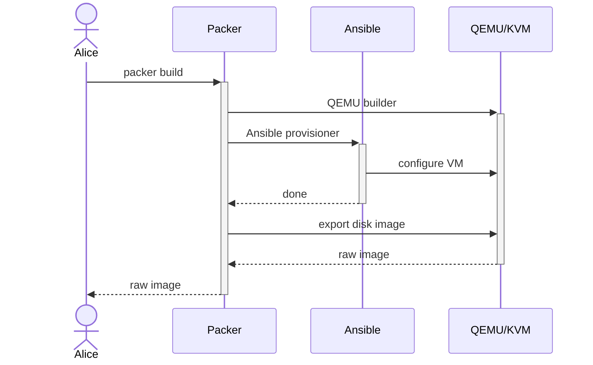
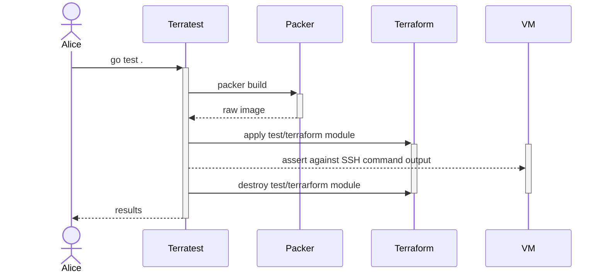

# Kubernetes image builder

This repositoy contains code for building virtual machine images of Rocky Linux 10 for running Kubernetes nodes using Cluster API with KubeVirt infrastructure provider and Kubeadm bootstrap and control plane providers.

Why not
[the official Kubernetes image builder?](https://github.com/kubernetes-sigs/image-builder)

- It is bloated with steps for operating systems, versions, and providers we don't need.
- It lags behind OS and Kubernetes versions.
- It does not have automated testing for QEMU images.
- It uses outdated Packer syntax.

## Usage

Initialize Packer:

```
packer init image.pkr.hcl
```

Build the image:

```
sudo --preserve-env=SSH_AUTH_SOCK packer build image.pkr.hcl
```

Run tests:

```
sudo --preserve-env=SSH_AUTH_SOCK $(which go) test ./...
```

The `SSH_AUTH_SOCK` environment variable is needed for SSH auth to GitHub for
cloning the `sneakybugs.kubernetes` Ansible Collection.

## How-to guides

### How-to prepare dependencies for building on Debian

Install dependencies for building images:

```
sudo apt-get install qemu-utils qemu-system-x86
```

### How-to prepare dependencies for testing on Debian

Install dependencies for testing images:

```
sudo apt-get install libvirt-daemon-system libvirt-clients xsltproc
```

Set `security_driver = "none"` in `/etc/libvirt/qemu.conf`.
Restart `libvirtd` to apply the configuration:

```
sudo systemctl restart libvirtd
```

### How-to generate pre-pulled images list

The image builder pulls images specified in `ansibe/roles/kubernetes/files/images.json`.
The `images.json` file can be generated by connecting to a cluster you wish to pre-pull all images the cluster uses and running the following:

```
kubectl get pods --all-namespaces --output=json | jq '[.items[].spec.containers[].image] | unique' > ansible/roles/kubernetes/files/images.json
```

### How-to troubleshoot images

The test can be configured for easier troubleshooting through the following environment variables:

- `TEST_EXISTING_TEMPLATE` skips the Packer build when set.
- `TEST_SKIP_DESTROY` doesn't destroy the test virtual machines when set.
- `TEST_ADDITIONAL_AUTHORIZED_KEYS` adds authorized keys to the test virtual machines, multiple public keys can be specified separated by newlines (`\n`).

Example using all available test options:

```
sudo TEST_ADDITIONAL_AUTHORIZED_KEYS="$(ssh-add -L)" TEST_EXISTING_TEMPLATE=y TEST_SKIP_DESTROY=y $(which go) test ./...
```

When your public key is added to the authorized key you can `ssh` to the test virtual machines as the `terraform` user.
The `virsh domifaddr` command can be used to get IPs of virtual machines the test creates.
To view another machine's IP, replace the `1` in the `sed` command.

```
sudo virsh domifaddr $(sudo virsh list | grep kib | awk '{print $2}' | sed -n '1 p')
```

The following command uses `fzf` to interactively choose which virtual machine you want to `ssh` to:

```
ssh "terraform@$(sudo virsh -q domifaddr $(sudo virsh list | grep kib | awk '{print $2}' | fzf) | awk '{print $4}' | sed -e 's:/24::')"
```

When done troubleshooting the virtual machines need to be destroyed manually:

```
cd test/terraform
sudo terraform destroy -var image=a -var 'authorized_keys=[]'
```

Tests can be run with `-v` to show log output as the test runs:

```
sudo $(which go) test ./... -v
```

To avoid caching the test when the test `*.go` files were not changed, use the `-count=1` option:

```
sudo $(which go) test ./... -count=1
```

## Requirements

### Scope

This repository builds a single machine image, of Rocky 9 with a single Kubernetes version.
Image versions are managed with Git tags.

### Functional requirements

- Machine image must be compatible with [KubeVirt Containerized Data Importer.](https://kubevirt.io/user-guide/operations/containerized_data_importer/)
- Machine image must be compatible with Kubeadm [bootstrap](https://github.com/kubernetes-sigs/cluster-api/tree/main/bootstrap/kubeadm) and [control plane](https://github.com/kubernetes-sigs/cluster-api/tree/main/controlplane/kubeadm) Cluster API providers.
- Machine image must contain QEMU guest agent.
- Machine image must contain Cloud Init.
- Machine image must contain kubeadm, kubelet, kubectl and CNI plugins.
- Machine image must be [set up with watchdog daemon.](https://kubevirt.io/user-guide/virtual_machines/liveness_and_readiness_probes/#defining-a-watchdog)
- Machine image must be prepared with a firewall setup.
- Machine image must be set up for audit logging.

### Nonfunctional requirements

- Automated tests (with Terratest?)
- Support Rocky Linux 9.
- Support only the latest Kubernetes version.
- CI pipeline with privileges and nested virtualization.
- Image distribution.

### Testing

- Terratest asserts verifying kubeadm, kubelet, and kubectl versions.
- Terratest test for disk resize.
- Terratest test bootstrapping a cluster with kubeadm and connecting to the Kubernetes API.

## Design

### Overview

Following [a successful POC on Debian](https://git.houseofkummer.com/Lior/terraform-libvirt),
we are building a new hyperconverged infrastructure platform based on KubeVirt, Cluster API, and Argo CD.

The first iteration of the image builder will be used to bootstrap a "Kubernetes as a service" service, which we will then run a "management" cluster on.
The "management" cluster will contain services such as CI runner and image registry that will be used by future iterations of the image builder.

### Requirement prioritization

| Requirement                                   | Priority | Risk |
| --------------------------------------------- | -------- | ---- |
| Compatible with KubeVirt                      | MH       | High |
| Compatible with kubeadm Cluster API providers | MH       | High |
| QEMU guest agent setup                        | MH       | Low  |
| Cloud Init setup                              | MH       | Low  |
| Firewall setup                                | NTH      | Low  |
| CI pipeline                                   | NTH      | High |
| Image distribution                            | NTH      | High |

**Priority key:** MH - must have, NTH - nice to have.

### Functional description

The image builder will be a Packer template.
The Packer template will use the QEMU builder because it outputs our required image type.
The Packer template will use [the Ansible provisioner](https://developer.hashicorp.com/packer/integrations/hashicorp/ansible/latest/components/provisioner/ansible) to run an Ansible playbook for configuring the machine.



The image builder will have automated tests written with Terratest in Go.
The test will use Terraform with `dmacvicar/libvirt` provider to provision virtual machines from image artifacts.
Such setup will also allow bootstrapping a cluster over SSH and connecting to the Kubernetes API using the official Go Kubernetes client.



The parts are split into folders in the repository:

- Root folder containing the Packer template.
- `playbook` folder containing an Ansible playbook configuring the image to be a Kubernetes node.
- `test` folder containing Terratest tests.
- `test/terraform` folder containing a Terraform module using `dmacvicar/libvirt` provider for provisioning virtual machines from an image artifact.

### Milestones

1. Packer template for Rocky Linux 9 with QEMU builder (without Ansible provisioner).
1. Terraform module in `test/terraform` for provisioning a Libvirt VM from the raw image.
1. Terratest tests for disk resizing and kubeadm/kubelet/kubectl versions.
1. Ansible playbook preparing for running kubeadm.
1. Terratest test running kubeadm and connecting with Kubernetes client.

## Useful resources

Packer related resources:

- [Rocky Linux downloads.](https://rockylinux.org/download)
- [Rocky Linux machine images.](https://dl.rockylinux.org/pub/rocky/9/images/x86_64)
- [Packer QEMU builder.](https://developer.hashicorp.com/packer/integrations/hashicorp/qemu/latest/components/builder/qemu)
- [Official Kubernetes image builder project.](https://github.com/kubernetes-sigs/image-builder)
- [Official Kubernetes QEMU image builder.](https://github.com/kubernetes-sigs/image-builder/tree/main/images/capi/packer/qemu)
- [Example Packer repository with automated tests.](https://github.com/LKummer/packer-alpine)
- [Cloud Init NoCloud documentation.](https://cloudinit.readthedocs.io/en/latest/reference/datasources/nocloud.html)
- [Systemd - Building images safely.](https://systemd.io/BUILDING_IMAGES/)

Kubeadm related resources:

- [Kubeadm installation guide.](https://kubernetes.io/docs/setup/production-environment/tools/kubeadm/install-kubeadm/)
- [Kubeadm reference documentation.](https://kubernetes.io/docs/reference/setup-tools/kubeadm/)

KubeVirt related resources:

- [KubeVirt Containerized Data Importer lab.](https://kubevirt.io/labs/kubernetes/lab2.html) (How the image artifact will be used)
- [KubeVirt UEFI settings.](https://kubevirt.io/user-guide/virtual_machines/virtual_hardware/#biosuefi)
- [KubeVirt CDI image format support.](https://kubevirt.io/user-guide/operations/containerized_data_importer/#supported-image-formats)

Libvirt related resources:

- [Libvirt pool permission error troubleshooting.](https://github.com/dmacvicar/terraform-provider-libvirt/issues/978#issuecomment-1276244924)

Firewall related resources:

- [Kubernetes ports and protocols.](https://kubernetes.io/docs/reference/networking/ports-and-protocols/)
- [Calico ports and protocols.](https://docs.tigera.io/calico/latest/getting-started/kubernetes/requirements#network-requirements)
