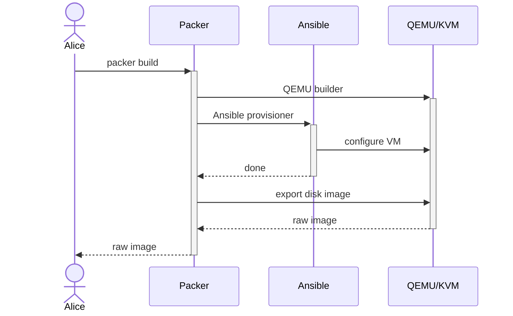
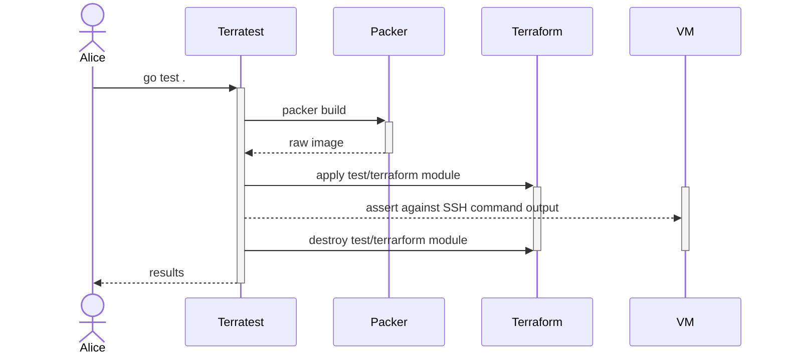

# Kubernetes image builder

## Usage

Build the image:

```
sudo packer build image.pkr.hcl
```

## Requirements

### Scope

This repository builds a single machine image, of Rocky 9 with a single Kubernetes version.
Image versions are managed with Git tags.

### Functional requirements

- Machine image must be compatible with [KubeVirt Containerized Data Importer.](https://kubevirt.io/user-guide/operations/containerized_data_importer/)
- Machine image must be compatible with Kubeadm [bootstrap](https://github.com/kubernetes-sigs/cluster-api/tree/main/bootstrap/kubeadm) and [control plane](https://github.com/kubernetes-sigs/cluster-api/tree/main/controlplane/kubeadm) Cluster API providers.
- Machine image must contain QEMU guest agent.
- Machine image must contain Cloud Init.
- Machine image must contain kubeadm, kubelet, kubectl and CNI plugins.
- Machine must be prepared with a firewall setup.

### Nonfunctional requirements

- Automated tests (with Terratest?)
- Support Rocky Linux 9.
- Support only the latest Kubernetes version.
- CI pipeline with privileges and nested virtualization.
- Image distribution.

### Testing

- Terratest asserts verifying kubeadm, kubelet, and kubectl versions.
- Terratest test for disk resize.
- Terratest test bootstrapping a cluster with kubeadm and connecting to the Kubernetes API.

## Design

### Overview

Following [a successful POC on Debian](https://git.houseofkummer.com/Lior/terraform-libvirt),
we are building a new hyperconverged infrastructure platform based on KubeVirt, Cluster API, and Argo CD.

The first iteration of the image builder will be used to bootstrap a "Kubernetes as a service" service, which we will then run a "management" cluster on.
The "management" cluster will contain services such as CI runner and image registry that will be used by future iterations of the image builder.

### Requirement prioritization

| Requirement                                   | Priority | Risk |
| --------------------------------------------- | -------- | ---- |
| Compatible with KubeVirt                      | MH       | High |
| Compatible with kubeadm Cluster API providers | MH       | High |
| QEMU guest agent setup                        | MH       | Low  |
| Cloud Init setup                              | MH       | Low  |
| Firewall setup                                | NTH      | Low  |
| CI pipeline                                   | NTH      | High |
| Image distribution                            | NTH      | High |

**Priority key:** MH - must have, NTH - nice to have.

### Functional description

The image builder will be a Packer template.
The Packer template will use the QEMU builder because it outputs our required image type.
The Packer template will use [the Ansible provisioner](https://developer.hashicorp.com/packer/integrations/hashicorp/ansible/latest/components/provisioner/ansible) to run an Ansible playbook for configuring the machine.



The image builder will have automated tests written with Terratest in Go.
The test will use Terraform with `dmacvicar/libvirt` provider to provision virtual machines from image artifacts.
Such setup will also allow bootstrapping a cluster over SSH and connecting to the Kubernetes API using the official Go Kubernetes client.



The parts are split into folders in the repository:

- Root folder containing the Packer template.
- `playbook` folder containing an Ansible playbook configuring the image to be a Kubernetes node.
- `test` folder containing Terratest tests.
- `test/terraform` folder containing a Terraform module using `dmacvicar/libvirt` provider for provisioning virtual machines from an image artifact.

### Milestones

1. Packer template for Rocky Linux 9 with QEMU builder (without Ansible provisioner).
1. Terraform module in `test/terraform` for provisioning a Libvirt VM from the raw image.
1. Terratest tests for disk resizing and kubeadm/kubelet/kubectl versions.
1. Ansible playbook preparing for running kubeadm.
1. Terratest test running kubeadm and connecting with Kubernetes client.

## Useful resources

Packer related resources:

- [Rocky Linux downloads.](https://rockylinux.org/download)
- [Rocky Linux machine images.](https://dl.rockylinux.org/pub/rocky/9/images/x86_64)
- [Packer QEMU builder.](https://developer.hashicorp.com/packer/integrations/hashicorp/qemu/latest/components/builder/qemu)
- [Official Kubernetes image builder project.](https://github.com/kubernetes-sigs/image-builder)
- [Official Kubernetes QEMU image builder.](https://github.com/kubernetes-sigs/image-builder/tree/main/images/capi/packer/qemu)
- [Example Packer repository with automated tests.](https://git.houseofkummer.com/homelab/devops/packer-alpine)
- [Example Libvirt Terraform modules that can be used for testing images.](https://git.houseofkummer.com/Lior/terraform-libvirt-images/-/tree/main?ref_type=heads)
- [Cloud Init NoCloud documentation.](https://cloudinit.readthedocs.io/en/latest/reference/datasources/nocloud.html)

Kubeadm related resources:

- [Previous POC playbook for preparing Rocky for Kubeadm bootstrap.](https://git.houseofkummer.com/Lior/terraform-libvirt/-/blob/b7241fe100e6f6e5981ce13948d471b83d5325f3/playbook/main.yml)
- [Kubernetes CNI installation from package manager.](https://github.com/kubernetes-sigs/image-builder/blob/main/images/capi/ansible/roles/kubernetes/tasks/redhat.yml#L34) Previous Ansible playbook [downloaded CNI plugins manually.](https://git.houseofkummer.com/Lior/terraform-libvirt/-/blob/b7241fe100e6f6e5981ce13948d471b83d5325f3/playbook/main.yml#L85-102)
- [Kubeadm installation guide.](https://kubernetes.io/docs/setup/production-environment/tools/kubeadm/install-kubeadm/)
- [Kubeadm reference documentation.](https://kubernetes.io/docs/reference/setup-tools/kubeadm/)

KubeVirt related resources:

- [KubeVirt Containerized Data Importer lab.](https://kubevirt.io/labs/kubernetes/lab2.html) (How the image artifact will be used)
- [KubeVirt UEFI settings.](https://kubevirt.io/user-guide/virtual_machines/virtual_hardware/#biosuefi)
- [KubeVirt CDI image format support.](https://kubevirt.io/user-guide/operations/containerized_data_importer/#supported-image-formats)
